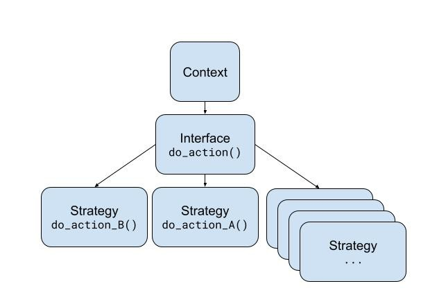

# Strategy pattern

## Basic idea

- One generic action (business logic) need to be executed with some variants.
- Open to extension, close to modification.
- Keep isolated business logic from implementation logic (proper evolution and new features).

## How we do it?

## When use it?

- There is a lot of classes that does the same but with a few implementation differences.
